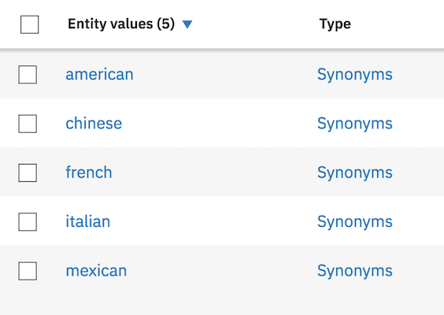
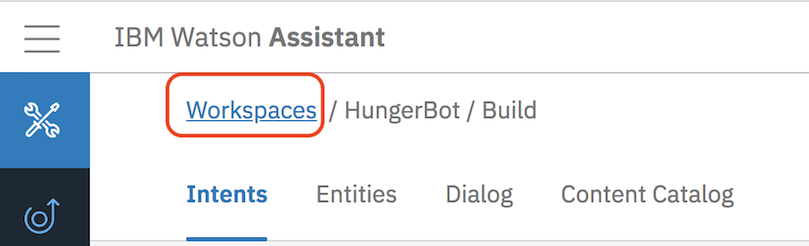

# Introduction to Watson Assistant

## Overview

Watson Assistant service combines machine learning, natural language understanding, and integrated dialog tools to create conversation flows between your apps and your users. In this lab, you will create a workspace and understand the terminology of creating a chatbot.

## Part 1 Building a bot from scratch

### Step 1: Designing Your Bot

Building a chatbot with Watson Assistant is so easy, some developers choose to dive right into the tooling. However, with a well-thought out, well-planned chatbot, the interaction with the user can lead to a much better experience that can handle edge cases. In this section, we will design the interaction between a user, Dave, and a chatbot named HungerBot.

A good question to ask yourself is, "Who is my user and what problem do they have?" Expand on the user's profile by determining what the user needs from this chatbot. Does the user have a need to book a reservation at a restaurant? Or an answer to a common question like "Where's the bathroom?" at a conference. Maybe a chatbot that handles tasks like turning on lights or other equipment. It might help to think of the chatbot as an automated version of an existing agent, such as a customer service agent. Look at existing processes that include repeated manual processes, which can sometimes be augmented with chatbots.

Training a chatbot is like training a human agent. You will train the chatbot with the knowledge of certain tasks (intents) and things that these tasks interact with (entities). These components are then combined to create a dialog tree that can take one or more paths to respond to the user's request.

In the following steps, we have provided a sample restaurant chatbot that handles reservations for a restaurant. 

1. Envision the user that interacts with the bot.

  | Example                                         |
  | ----------------------------------------------- |
  | A user needs to book a table at the restaurant  |

2. Now, let's describe the overall function of the chatbot.

  | Example                                                   |
  | --------------------------------------------------------- |
  | The chatbot helps users with common tasks at a restaurant |

   
3. It can be helpful to take a snapshot of an existing dialogue and then break it down into intents and entities. A sample conversation is shown below. Keep the conversation simple…you can always add more complex logic later.

  | Example                                                          |
  | ---------------------------------------------------------------- |
  | Bot: Hi, I'm HungerBot. You can ask to reserve a table and more. | 
  | Dave: I want to book a table. 	                               | 
  | Bot: What type of cuisine would you like?                        |
  | Dave: I like Mexican food                                        | 
  | Bot: How many people will be coming ?                            | 
  | Dave: Five people                                                | 
  | Bot: Excellent ! Here are the details of your booking            |

4. Let's start with the action the user wants to do, which is referred to as an intent. Frist we write a human-friendly description of the action the user is wanting to perform. Then we list at least five ways the user might phrase this action. Lastly, add a label, like a variable name in code (alpha-numeric, underscores, etc.), that can be used later as a reference.

  | Example                                                          |
  | ---------------------------------------------------------------- |
  | Intent: book a reservation                                       | 
  | Variations                                                       | 
  | 1. Reserve a table                                               | 
  | 2. Book a reservation                                            | 
  | 3. Make a reservation                                            | 
  | 4. Secure a reservation                                          | 
  | 5. Schedule a reservation                                        | 
  | Label: #book_reservation                                         | 

  If you find that you don't have many variations, invite a colleague, a friend (or a real user!) to suggest how they would ask "to book a reservation." In the real world, you could use customer interactions as a base of inspiration.

5. Another component to training a chatbot is recognizing objects, which are referred to as entities. This example reservation system can differentiate different types of cuisine. We add a type of cuisine to booking a reservation.

  | Example                                                          |
  | ---------------------------------------------------------------- | 
  | Entity: type of cuisine                                          | 
  | Variations                                                       | 
  | 1. Mexican                                                       | 
  | 2. Chinese                                                       | 
  | 3. American                                                      | 
  | 4. Italian                                                       | 
  | Label: @cuisine                                                  | 

  
 We could add time and number entities, however, there are some built-in system entities provided by IBM, like numbers, dates, and times, that the HungerBot will use. 

In the Dialog editor of Watson Assistant, we can now setup logic to step the user through the conversation. In the next section, we will use this design to train the Watson Assistant service.

### Step 2: Train Watson Assistant Service

Now that we have designed the first dialogue between the chatbot and the user, we can train the Watson Assistant service. Sign up for an IBM Cloud account at bluemix.net. If you already have an account, sign into your account.

1. **Click on the Catalog*** link in the top-right corner of the IBM Cloud dashboard.

2. **Select the Watson Assistant** tile under the section titled Watson.

3. Click **Create**

4. Click on the  **Launch tool** button to launch into the Watson Assistant tooling.

5. This is the Watson Assistant tooling where you can create workspaces and setup different chatbots dialogues and applications. There is an example Cognitive Car Dashboard workspace where you can see a more evolved training. However, we'll create a new workspace for our bot to use. Click on **Workspaces** and then on  **Create**   in the box labeled **Create a new workspace**.

6. Enter a name for the chatbot and click **Create**

7. You will be redirected into a page with three tabs, Intents, Entities, and Dialog. Under the Intents tab, click on **Add intent**  to create the first intent.

8. Name the intent *#book_reservation* and click **Create intent**

9. Add the following examples clicking on **Add example** after entering each one 

10. Click on the return icon to go back to the main menu screen

11. Click on the **Entities** tab in the top menu bar. This is where you can add entities. Click **Add entity**

12. Name the entity *@cuisine* and add the following values clicking **Add value** after entering each one

13. Click in the return icon to go back to the main menu screen

14. The Watson Assistant has a handful of common entities created by IBM that can be used across any use case. These entities include: date, time, currency, percentage, and numbers. Click on **System entities** and enable @sys-date, @sys-number and @sys_time

15. Click on the Dialog tab in the top menu bar. Click Create. There are two nodes added by default. The welcome condition is triggered when the chatbot is initially started. This is a good place to introduce the bot and suggest actions the user can ask of this chatbot. Select the Welcome node and change the response as shown below:

16. The second node checks for the condition anything_else. In the event the user enters something that wasn't expected, the service will return this response. Ideally, it should convey a way for the user to recover, such as example phrases.

17. Select the Welcome node again and click **Add node**

18. Name the node *Book Reservation* and select the #book-reservation intent where it says **if bot recognizes**

19. Click on **Customize** in the top right corner. Enable Slots and Prompt for everything. Click **Apply**

20. Add a slot for @cuisine, with the prompt `What type of cuisine would you like?`

21. Add another slot for @sys-date, with the prompt `What day would you like to reserve?`

22. Add another slot for @sys-time, with the prompt `What time would you like to reserve?`

23. Add another slot for @sys-number, with the prompt `How many people will be coming?`

24. If no slots are prefilled, prompt the user to provide a cuisine. `Sure I can help make a reservation. What type of cuisine did you want ?`

25.Have the bot respond with the details of the reservation. The syntax uses the values stored in the context and injects the values into the response. The full text should read:
`Great! I've booked a table for <? $number ?> people on <? date ?> at <? $time ?> for <? $cuisine ?>`

### Step 3: Test Watson Assistant Service

The Watson Assistant tooling offers a testing panel to test phrases to confirm the correct intents, entities, and dialog are matched and returned.

1. To test the bot, click on the **Try it** icon in the top-right corner of the tooling.

2. A side panel appears and shows the contents of the node that matches welcome. Enter a message that triggers the #book_reservation intent. We can ask *book a table*

3. Notice that the intent #book_reservation was recognized. The #book_reservation node was triggered and the output includes the response from the Book Reservation node. The user is prompted for a choice of cuisine.

  

4. When the user enters a cuisine, the @cuisine entity is recognized.

  

5.When the user enters a date or time, Watson extracts out the value using the system entities @sys-date and @sys-time.

  

6.Finally, when the user enters a number (either numerically or spelled out) for the number of people in the reservation, Watson extracts out the number using the system entity @sys-number.

  

7. Click on the **Clear** link to start over with the test tool. After typing  *book a reservation* to trigger the intent when initially prompted you can type in all the required information and the  bot will be smart enough not to promptt you. Type `book a table` when prompted.

8. Type in the following when prompted for the cuisine:
`American for 5 people at 9pm next friday`
Note how you are not prompted for any further information because all the required info to make the reservation has already  been provided. 

  

## Part 2 Extending an existing bot
In this part of the lab you'll import an existing bot and get the opportunity to extend it by using the skills you learned in Part 1. 

1. Test drive the app driving the bot you'll import. It is a simple Portfolio Management bot that allows the users to caht about thoer invstment porftolios. Try out some of the questions that are on the landing page of the app. The app can be found [here](https://wealth-management-chatbot-1.mybluemix.net/demo.html) 

2. Download the  json source of the existing chatbot to your machine. Use the "Save As" capability of your browser to save the contents of [this URL](https://raw.githubusercontent.com/djccarew/watson-assistant-lab/master/workspaces/portfolio-bot.json) to a local json file

3. In the Watson Assistant tooling click on the **Workspaces** breadcrumb

4. Click on the Import icon

5. Click on **Choose a file** and select the json file you saved locally. Click **Import**

6. This will load the imported workspace into your instance of Assistant. Take a look at the Intents, Entities and Dialog of the imported bot. In the Dialog tab pay particluar attention to how the top level intents are handled. 

7. Extend the imported workspace by adding your own functionality. Here are a couple of suggestions:

  - Generate a sell order for one of the user's holdings if the price  drops below a certian specified threshold 
  
  - Generate a buy  order for a specified stock if the P/E ratio falls  below a certain specified threshold 

8. After choosing one the scenarios above (or coming up with your own scenario),  plan out the intent(s), any required entities,  and the conversation flow prior to implementing. Once you're ready to implement you'll have to do the following:

  - Create intent(s) and provide at least 5 examples 
  
  - Create any required entities (feel free to reuse the existing ones too)
  
  - Add a top level node(s) triggered by your new intent(s)
  
  - Test using the **Try It** tool
  
## Summary

The Watson Assistant service was able to handle gathering multiple pieces of information, parsing the user input, and placing the values into a context that was used to inject into the response back to the user.

